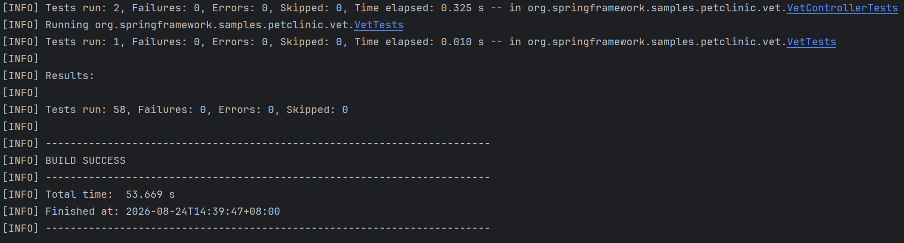

### 本周已完成

##### **1. 项目与版本矩阵**

| 组件            | 版本                                       | 说明                               |
| --------------- | ------------------------------------------ | ---------------------------------- |
| Java            | 17.0.4.1                                   | 固定                               |
| Spring Boot     | 3.5.16                                     | 当前基线                           |
| Spring Data JPA | 3.5.4                                      | Boot BOM 管理                      |
| Hibernate       | 6.6.29.Final                               | Boot BOM 管理                      |
| MySQL           | 9.2                                        | 镜像 `mysql:9.2`                   |
| Testcontainers  | 2.0.2                                      | 本次升级，解决 Docker Desktop 兼容 |
| Maven           | 3.9.9                                      | 本机                               |
| 上游提交        | `66747e344ec6d4ec5fce2c603c1b61eeeadda8ff` | 冻结基线                           |

##### **2. 仓库与分支策略**

- 上游冻结 SHA：`66747e3`
- 本地基线提交：`d573224`
- 当前 HEAD：`50b2272`（Testcontainers 升级）
- 分支计划：`main` + `develop` + `feature/*`（后续 PR 用）

##### **3. 数据库场景与配置**

说明项目支持的三种数据库及各自配置文件/脚本：

- H2（默认）：`application.properties` + `db/h2/`
- MySQL：`application-mysql.properties` + `db/mysql/`，用 Spring Profile `mysql`
- PostgreSQL：`application-postgres.properties` + `db/postgres/`，用 Spring Profile `postgres`

##### **4. 已完成工作**

已完成的验证：

- **Maven 全量测试**：58 tests / 0 failures / 0 errors / 0 skipped（Boot 3.5.6）

```bash
mvn -s D:\codex\job-projects\maven-settings.xml -gs D:\codex\job-projects\maven-settings.xml -B -ntp -U -Dtest=MySqlIntegrationTests test   
```



- **H2 启动 + 页面走查 + 链路追踪**：Controller → Repository → JPA → H2 已验证

```bash
mvn -s D:\codex\job-projects\maven-settings.xml -gs D:\codex\job-projects\maven-settings.xml -B -ntp spring-boot:run "-Dspring-boot.run.arguments=--logging.level.org.hibernate.SQL=debug --logging.level.org.hibernate.orm.jdbc.bind=trace --spring.h2.console.enabled=true"
```

- **Testcontainers MySQL**：`MySqlIntegrationTests` 2 个测试真实执行通过（`@ServiceConnection` 自动连 `test/test` + 随机端口）
- **compose + mysql Profile**：数据初始化、重启保留、删库重建三项通过（`petclinic/petclinic` + `localhost:3306`）

```bash
docker compose up -d mysql
docker compose ps
docker compose logs mysql --tail 30
mvn -s D:\codex\job-projects\maven-settings.xml -gs D:\codex\job-projects\maven-settings.xml -B -ntp spring-boot:run "-Dspring-boot.run.profiles=mysql"
docker compose exec mysql mysql -upetclinic -ppetclinic petclinic -e "SELECT COUNT(*) AS owners FROM owners; SELECT id, first_name, last_name FROM owners LIMIT 5;"
# 重启和删库后重启
docker compose restart mysql    
docker compose down -v				# -v 会删除匿名数据卷
docker compose up -d mysql

```

- 提交git

```bash
cd D:\codex\job-projects\spring-petclinic
git add docs/technology-baseline.md
git commit -m "docs: add technology baseline"
```


##### **5. 已知限制**

当前还没解决/没验证的点：

- Spring Boot 3.5.16 升级**已执行并复测通过**
- MySQL 应用运行验证已过，但**未配置 GitHub remote / CI**
- Testcontainers 2.0.2 是本次为兼容 Docker Desktop 新管道协议而升级的，若项目要跟 Boot 3.5.16 再验一次需复测
- 上游基线含 Postgres 服务，但本次未验证 Postgres 应用运行